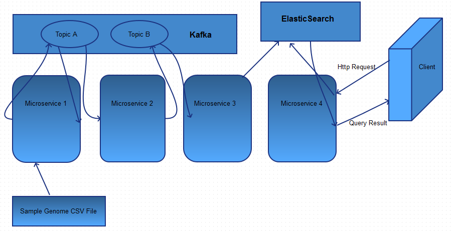

# Scala-Projects-Colaberry



## Mircroservice/Project 1:

Micro‐Service to ingest data from a flat file to Kafka
 * Genome sample data set hosted by Google here shall be used as the sample ingest data.
 * File location, file name shall be configurable
 * Topic name, Kafka stream end points shall be configurable


## Mircroservice/Project 2: 

Micro‐Service to consume Kafka stream on a configured topic to enhance the
data and add to a new topic.
 * Input topic for the raw data stream and output topic for the enhanced data stream shall be configurable
 * Kafka end points shall be configurable


## Mircroservice/Project 3: 

Micro‐Service to consume enhanced data records from Kafka stream and ingest
to Elastic Search
 * Input topic for the enhanced data stream shall be configurable
 * End points for the Elastic Search shall be configurable
 * Partition/Index/Object Types shall be configurable


## Mircroservice/Project 4:

HTTP Micro‐Service that offers API to search for data stored in Elastic Search
 * Elastic Search end points shall be configurable
 * HTTP Endpoints shall be configurable
 * Must list APIs offered by the service

## How to Build and Run
 * Download and import into IDE (created in IntelliJ)
 * Run each Microservice in order
 ```scala
 sbt run
 ```
 ** Order to run: 3-4-5
- [1] ElasticSearch.ElasticConsumer
 -[2] KafkaMain.FileConsumer
 -[3] KafkaMain.FileWriter
 -[4] KafkaMain.KafkaToKafka
 -[5] RESTService.RestMicroservice

